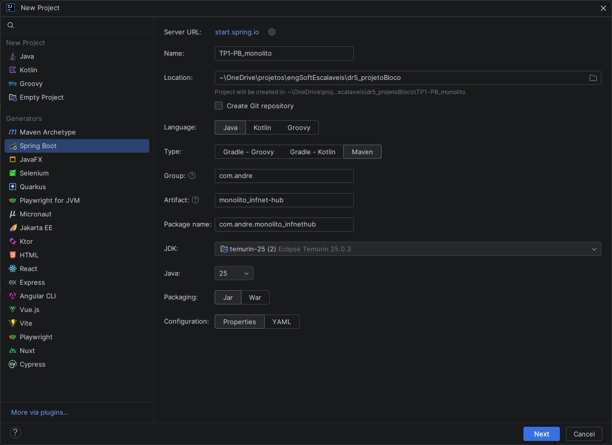
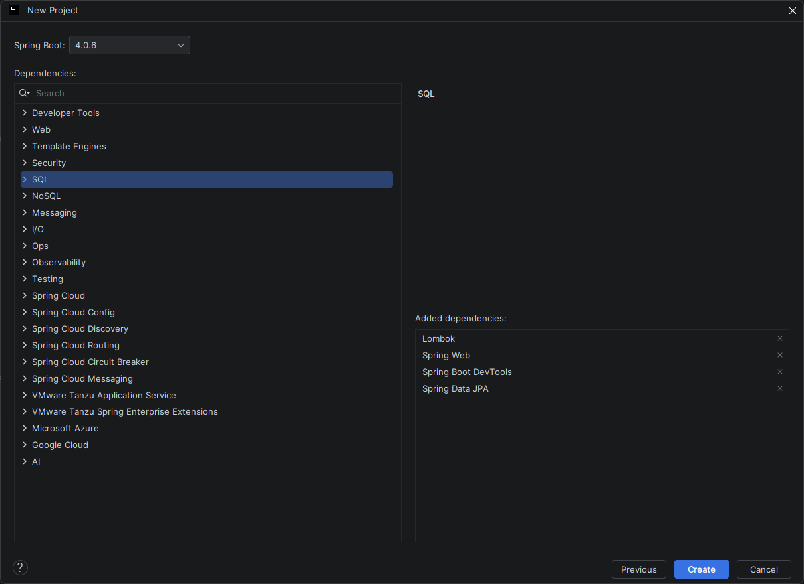
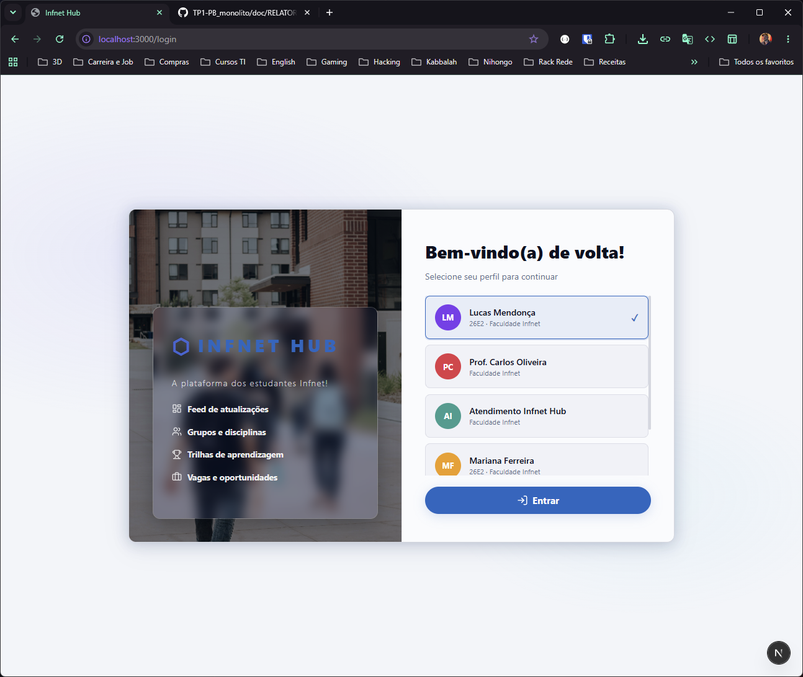
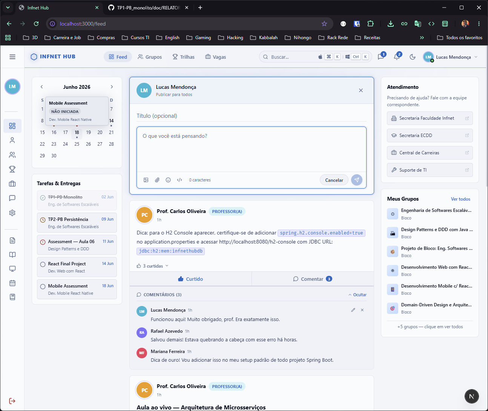

# Relatório Técnico — Infnet Hub · TP2: Camada de Persistência Real com JPA e Spring Data

> **Trimestre:** 26E2 · **Bloco:** Engenharia de Softwares Escaláveis
> **Disciplina:** Projeto de Bloco: Engenharia de Softwares Escaláveis (DR5)
> **Instituição:** Faculdade Infnet
> **Aluno:** André Luis Becker
> **Domínio:** Plataforma Educacional Infnet Hub

> Este documento consolida o projeto em um único relatório: a **Parte I** registra as fundações
> arquiteturais estabelecidas na primeira etapa (monólito em camadas, DDD, SOLID, API REST);
> a **Parte II** — o núcleo desta entrega — apresenta a **camada de persistência real**, com
> mapeamento objeto-relacional, repositórios Spring Data, histórico de dados e testes;
> a **Parte III** cobre operação, dependências e entrega.

---

## Sumário

**Parte I — Fundações da Aplicação**

1. [Introdução](#1-introdução)
2. [Arquitetura da Solução](#2-arquitetura-da-solução)
3. [Diagramas de Sequência](#3-diagramas-de-sequência)
4. [Modelagem DDD](#4-modelagem-ddd)
5. [Princípios SOLID](#5-princípios-solid)
6. [Design Patterns Aplicados](#6-design-patterns-aplicados)
7. [Front-End](#7-front-end)

**Parte II — Camada de Persistência · o foco do TP2**

8. [O que mudou em relação ao TP1](#8-o-que-mudou-em-relação-ao-tp1)
9. [Arquitetura da Camada de Persistência](#9-arquitetura-da-camada-de-persistência)
10. [Modelagem de Dados](#10-modelagem-de-dados)
11. [Mapeamento Objeto-Relacional (JPA)](#11-mapeamento-objeto-relacional-jpa)
12. [Repositórios Spring Data](#12-repositórios-spring-data)
13. [Exemplos de Uso dos Repositórios](#13-exemplos-de-uso-dos-repositórios)
14. [Histórico de Dados e Auditoria](#14-histórico-de-dados-e-auditoria)
15. [Integridade e Performance](#15-integridade-e-performance)
16. [Migrations e Evolução do Schema](#16-migrations-e-evolução-do-schema)
17. [Perfis de Configuração](#17-perfis-de-configuração)
18. [Testes Automatizados](#18-testes-automatizados)

**Parte III — Operação e Entrega**

19. [API REST](#19-api-rest)
20. [Como Executar](#20-como-executar)
21. [Gerenciamento de Dependências](#21-gerenciamento-de-dependências)
22. [Instruções para o Repositório Git](#22-instruções-para-o-repositório-git)
23. [Referências](#23-referências)

---

# Parte I — Fundações da Aplicação

## 1. Introdução

O **Infnet Hub** é uma plataforma educacional com feed social acadêmico, vagas de carreira,
comentários, curtidas e perfis com papéis institucionais (Aluno, Professor, Secretaria,
Coordenador). A primeira etapa do projeto entregou o monólito Spring Boot em camadas com API
REST sobre esse domínio, demonstrando arquitetura em camadas, princípios SOLID, modelagem DDD
e integração com um front-end React/Next.js.

A persistência daquela etapa, porém, era ilusória: um H2 **em memória** com
`ddl-auto=create-drop`, que descartava todos os dados a cada reinício.

Esta segunda entrega substitui aquela camada por uma **persistência real** e, além do CRUD,
introduz **histórico de dados**: a capacidade de responder não apenas *"como este registro
está?"*, mas *"como ele estava em cada ponto do tempo, e quem o alterou?"* — requisito central
para auditoria e rastreabilidade.

A tese central deste trabalho é que **persistência real não é só trocar o banco**. É garantir
que os dados sobrevivam, que o schema evolua de forma versionada, que a integridade seja
arbitrada pelo banco e não pela aplicação, que as consultas não degradem com o volume, e que
toda mudança deixe rastro.

---

## 2. Arquitetura da Solução

### 2.1 Visão Geral

```
┌─────────────────────────────────────────────────────────────────┐
│                     Cliente (Browser)                           │
│              Next.js 16 · React 19 · TypeScript                 │
│                    localhost:13000                              │
└──────────────────────────┬──────────────────────────────────────┘
                           │ HTTP REST (JSON) + header X-Usuario-Id
                           ▼
┌─────────────────────────────────────────────────────────────────┐
│                  Spring Boot Application                        │
│                     localhost:18080                             │
│                                                                 │
│  ┌──────────────┐    ┌──────────────┐    ┌──────────────────┐   │
│  │  Controller  │───▶│   Service    │───▶│   Repository     │   │
│  │  (HTTP/REST) │    │  (Negócio)   │    │  (Spring Data)   │   │
│  └──────────────┘    └──────────────┘    └────────┬─────────┘   │
│         │                                         │             │
│  ┌──────┴──────┐                         ┌────────▼─────────┐   │
│  │    DTOs     │                         │  Hibernate 7.2   │   │
│  │  Request/   │                         │    + Envers      │   │
│  │  Response   │                         └────────┬─────────┘   │
│  └─────────────┘                                  │             │
│  ┌──────────────┐    ┌──────────────┐             │             │
│  │  Exception   │    │  Auditoria   │             │             │
│  │  Handler     │    │  Filter +    │             │             │
│  └──────────────┘    │  ThreadLocal │             │             │
│                      └──────────────┘             │             │
└───────────────────────────────────────────────────┼─────────────┘
                                                    ▼
                                       ┌──────────────────────────┐
                                       │   PostgreSQL 18          │
                                       │   schema Flyway (V1, V2) │
                                       │   localhost:15432        │
                                       └──────────────────────────┘
```

### 2.2 Diagrama de Componentes

```
com.andre.monolito_infnethub
│
├── auditoria/                       ← novo no TP2
│   ├── ContextoAuditoria            → ThreadLocal com autor e origem
│   ├── ContextoAuditoriaFilter      → extrai o autor da requisição
│   ├── RevisaoAuditoria             → @RevisionEntity (quem/quando/origem)
│   └── RevisaoAuditoriaListener     → carimba cada revisão
│
├── config/
│   ├── AuditoriaConfig              → @EnableJpaAuditing + @EnableEnversRepositories
│   ├── CorsConfig                   → configuração global de CORS
│   └── DataLoader                   → carga inicial via JPA (@Profile dev)
│
├── controller/
│   ├── UsuarioController            → /api/v1/usuarios
│   ├── PostController               → /api/v1/posts
│   ├── VagaController               → /api/v1/vagas
│   ├── ComentarioController         → /api/v1/posts/{id}/comentarios
│   ├── CurtidaController            → /api/v1/posts/{id}/curtidas
│   └── HistoricoController          → /api/v1/historico/**   ← novo no TP2
│
├── dto/
│   ├── historico/                   → RevisaoDTO, PaginaDTO, *Snapshot, TipoAlteracao
│   └── *RequestDTO / *ResponseDTO
│
├── exception/
│   ├── ResourceNotFoundException    → 404
│   ├── ConflitoDeDadosException     → 409   ← novo no TP2
│   └── GlobalExceptionHandler       → @RestControllerAdvice
│
├── model/
│   ├── EntidadeAuditavel            → @MappedSuperclass   ← novo no TP2
│   ├── Usuario · Post · Vaga · Comentario · Curtida
│   └── Papel · TipoVaga             → enums
│
├── repository/
│   ├── RevisaoAuditoriaRepository   → linha do tempo global   ← novo no TP2
│   └── Usuario/Post/Vaga/Comentario/CurtidaRepository
│
└── service/
    ├── HistoricoService             → consulta de histórico   ← novo no TP2
    └── Usuario/Post/Vaga/Comentario/CurtidaService (+ impl/)
```

### 2.3 Origem do projeto

O projeto foi iniciado no IntelliJ IDEA com o gerador Spring Boot integrado (`start.spring.io`):


*Spring Initializr configurado com Maven, Java 25, group `com.andre` e artifact `monolito_infnet-hub`.*


*Dependências iniciais: Lombok, Spring Web, Spring Boot DevTools e Spring Data JPA.*

---

## 3. Diagramas de Sequência

### 3.1 Listar Todos os Posts (GET /api/v1/posts)

```
Frontend          PostController       PostService        PostRepository      PostgreSQL
   │                     │                   │                   │                  │
   │──GET /posts────────▶│                   │                   │                  │
   │                     │──listarTodos()───▶│                   │                  │
   │                     │                   │──findAll…()──────▶│                  │
   │                     │                   │                   │──SELECT (2x)────▶│
   │                     │                   │                   │◀─List<Post>──────│
   │                     │                   │◀─List<Post>───────│                  │
   │                     │◀─List<ResponseDTO>│                   │                  │
   │◀──200 OK [JSON]─────│                   │                   │                  │
```

O feed executa exatamente **duas** consultas independentemente do volume — posts com autor
via `JOIN FETCH` e contagem agregada de comentários (ver [§ 13.3](#133-projeção-agregada--a-correção-do-n1)).

### 3.2 Criar Post (POST /api/v1/posts) — com auditoria

```
Frontend        Filter          PostController    PostService     PostRepository    PostgreSQL
   │              │                   │                │                │               │
   │─POST + X-Usuario-Id─▶            │                │                │               │
   │              │ resolve autor     │                │                │               │
   │              │ → ThreadLocal     │                │                │               │
   │              │──────────────────▶│                │                │               │
   │              │                   │ @Valid DTO     │                │               │
   │              │                   │──criar(dto)───▶│                │               │
   │              │                   │                │──save(post)───▶│               │
   │              │                   │                │                │──INSERT──────▶│
   │              │                   │                │                │  no commit,   │
   │              │                   │                │                │  Envers grava:│
   │              │                   │                │                │  revisao_     │
   │              │                   │                │                │  auditoria +  │
   │              │                   │                │                │  posts_aud───▶│
   │◀──201 CREATED [JSON]─────────────│                │                │               │
```

### 3.3 Erro — Recurso não encontrado (GET /api/v1/posts/99)

```
Frontend          PostController       PostService                     GlobalExceptionHandler
   │                     │                   │                                   │
   │──GET /posts/99─────▶│                   │                                   │
   │                     │──buscarPorId(99)─▶│                                   │
   │                     │                   │ findById(99) → empty              │
   │                     │                   │ throw ResourceNotFoundException   │
   │                     │                   │──────────────────────────────────▶│
   │                     │◀──────────────────────────────────────────────────────│
   │◀──404 Not Found─────│                   │                                   │
```

---

## 4. Modelagem DDD

| Conceito DDD          | Aplicação                                                                                 |
|-----------------------|-------------------------------------------------------------------------------------------|
| **Domain**            | Plataforma Educacional Infnet Hub                                                         |
| **Core Subdomain**    | Feed Social e Oportunidades de Carreira                                                   |
| **Support Subdomain** | Autenticação, validação, persistência e **auditoria**                                     |
| **Bounded Contexts**  | `Usuário` · `Post` · `Vaga`                                                               |
| **Aggregate Roots**   | `Usuario`, `Post`, `Vaga` — pontos de entrada para todas as operações                     |
| **Repositories**      | `UsuarioRepository`, `PostRepository`, `VagaRepository` — acesso sem expor infraestrutura |
| **Services**          | `UsuarioService`, `PostService`, `VagaService` — orquestram casos de uso                  |
| **DTOs**              | `*RequestDTO` / `*ResponseDTO` — anti-corruption layer entre API e domínio                |

O modelo físico completo — entidades, atributos, chaves e índices — está no
[§ 10 (Modelagem de Dados)](#10-modelagem-de-dados), já refletindo a camada de persistência.

---

## 5. Princípios SOLID

| Princípio                     | Implementação                                                                                                                                                             |
|-------------------------------|-----------------------------------------------------------------------------------------------------------------------------------------------------------------------------|
| **S** — Single Responsibility | `PostController` apenas roteia HTTP. `PostServiceImpl` apenas aplica regras de negócio. `PostRepository` apenas acessa dados. Cada classe tem uma única razão para mudar. |
| **O** — Open/Closed           | `PostService`, `UsuarioService`, `VagaService` são interfaces. Novas implementações (ex: com cache ou auditoria) não alteram o contrato.                                  |
| **L** — Liskov Substitution   | `PostServiceImpl` implementa `PostService` e pode ser substituída por qualquer outra implementação sem quebrar o `PostController`.                                        |
| **I** — Interface Segregation | Cada interface de serviço expõe apenas os métodos necessários para seu domínio — `PostService` não contém operações de vaga.                                              |
| **D** — Dependency Inversion  | Controllers dependem das abstrações (`PostService`, `VagaService`), não das implementações concretas. Injeção via `@RequiredArgsConstructor` (Lombok).                    |

A camada de persistência preserva os cinco princípios: o `HistoricoService` é interface com
implementação própria; os serviços dependem das abstrações dos repositórios Spring Data; e a
auditoria foi introduzida **sem alterar contrato algum** — evidência prática do Open/Closed.

---

## 6. Design Patterns Aplicados

| Pattern                   | Onde                                                                                                            |
|---------------------------|------------------------------------------------------------------------------------------------------------------|
| **Repository Pattern**    | `UsuarioRepository`, `PostRepository`, `VagaRepository` (extends `JpaRepository`) — abstraem o acesso ao banco  |
| **DTO Pattern**           | `*RequestDTO` / `*ResponseDTO` — separam a API do modelo interno, evitando exposição de entidades               |
| **Service Layer Pattern** | `PostService` / `PostServiceImpl`, `VagaService` / `VagaServiceImpl` — encapsulam regras de negócio             |
| **Facade**                | Controllers simplificam o acesso às operações dos serviços, ocultando complexidade do domínio                   |
| **Template Method**       | Hooks do ciclo de vida JPA — no TP2 centralizados no `AuditingEntityListener` via `EntidadeAuditavel`           |
| **Layer Supertype** ⭐    | `EntidadeAuditavel` (`@MappedSuperclass`) — campos comuns de auditoria herdados por todas as entidades          |
| **Observer / Listener** ⭐ | `RevisaoAuditoriaListener` (`RevisionListener` do Envers) — reage ao commit carimbando autor e origem           |
| **Context Object** ⭐     | `ContextoAuditoria` (`ThreadLocal`) — transporta o autor do filtro HTTP até o listener, fora do contêiner Spring |
| **Optimistic Offline Lock** ⭐ | `@Version` em `EntidadeAuditavel` — detecção de atualização perdida sob concorrência                       |

⭐ = introduzido nesta entrega, pela camada de persistência.

---

## 7. Front-End

### Tecnologia

- **Next.js 16** com App Router e **React 19** (`useState`, `useEffect`, `useCallback`)
- **TypeScript** para tipagem estática
- **CSS Modules** para estilização escopada

### Funcionalidades

- Feed de posts com curtidas e comentários em tempo real
- Listagem de vagas com filtro por tipo (CLT, Estágio, PJ, Trainee…)
- Badges de papel do usuário (Aluno, Professor, Secretaria, Coordenador) no feed e comentários
- Sidebar colapsável (mini 64px / expandida 264px) com ícones lucide-react
- Painéis laterais: calendário acadêmico, tarefas, atendimento institucional e grupos
- Busca global com atalho de teclado (⌘K / Ctrl+K) e sugestões em tempo real
- Tema claro/escuro com preferência persistida
- Notificações toast, estados de loading (skeleton) e tratamento de erros
- Página de login com seleção de perfil

### Comunicação com o Back-End

```
frontend/src/services/
  ├── api.ts             → headersEscrita(): injeta X-Usuario-Id do usuário logado
  ├── usuarioService.ts  → fetch() http://localhost:18080/api/v1/usuarios
  ├── postService.ts     → fetch() http://localhost:18080/api/v1/posts
  └── vagaService.ts     → fetch() http://localhost:18080/api/v1/vagas
```

Toda operação de escrita envia o header **`X-Usuario-Id`** com o id do usuário logado
(guardado no `localStorage` no login) — é ele que identifica o autor da mudança para a trilha
de auditoria descrita no [§ 14.4](#144-quem-fez-a-alteração).

### Screenshots da Interface


*Tela de login com seleção de perfil. Usuários carregados via `GET /api/v1/usuarios`.*


*Feed com publicações, curtidas, comentários, calendário acadêmico e atendimento institucional.*

### Ativos Visuais

| Asset                            | Autor                                                     | Licença                                          |
|----------------------------------|-----------------------------------------------------------|--------------------------------------------------|
| Foto de fundo da página de login | [Meredith Spencer](https://unsplash.com/@meredithspencer) | [Unsplash License](https://unsplash.com/license) |

Foto: *"Um grupo de pessoas andando em uma calçada"* —
https://unsplash.com/pt-br/fotografias/um-grupo-de-pessoas-andando-em-uma-calcada-QfE2FAW_oPI.
A Unsplash License permite uso gratuito, comercial e não comercial, sem exigência de atribuição.

---

# Parte II — Camada de Persistência · o foco do TP2

> É a parte central desta entrega, atendendo diretamente ao enunciado: **modelagem de dados**
> (§ 10), **JPA e mapeamento objeto-relacional** (§ 11), **repositórios Spring Data**
> (§ 12–13), **gerenciamento de dados com integridade e performance** (§ 15–16),
> **histórico de mudanças** (§ 14) e **testes automatizados** (§ 18).

## 8. O que mudou em relação ao TP1

| Aspecto | TP1 | TP2 |
|---|---|---|
| Banco | H2 em memória | **PostgreSQL 18** (Docker), H2 restrito a testes |
| Schema | `ddl-auto=create-drop` | **Flyway** versionado + `ddl-auto=validate` |
| Perfis | Um único, implícito | **dev · prod · test** |
| Histórico | Inexistente | **Hibernate Envers** — snapshot por revisão |
| Autoria | Inexistente | `@CreatedBy`/`@LastModifiedBy` + autor por revisão |
| Timestamps | `@PrePersist` repetido em cada entidade | `@MappedSuperclass` com Spring Data Auditing |
| Concorrência | Sem controle | **`@Version`** — bloqueio otimista |
| Integridade | Anotações JPA apenas | Constraints e checks **no banco** |
| Feed | **N+1**: 1 + N consultas | 2 consultas, independente do volume |
| Índices | Nenhum explícito | 12 índices derivados das consultas reais |
| Testes | 1 (`contextLoads`) | **33** |

### Por que PostgreSQL e não MySQL

A escolha foi guiada pelo domínio, não por preferência:

- **Busca global**: o front-end já tem busca com atalho ⌘K, hoje um `LIKE` ingênuo. O caminho natural de evolução é `tsvector` + índice GIN com suporte a português — o equivalente em MySQL é sensivelmente mais fraco.
- **Auditoria append-only**: as tabelas `_aud` só crescem. O PostgreSQL oferece índices parciais e `BRIN`, adequados a esse padrão.
- **Integridade**: `CHECK` é aplicado desde sempre; o MySQL só passou a aplicá-lo na versão 8.0.16.
- **Continuidade do projeto**: o TP4 trata de comunicação por eventos, e a captura de mudanças a partir do WAL do PostgreSQL (CDC/Debezium) é o caminho mais maduro. O TP5 trata de produção, onde o PostgreSQL é o padrão nos provedores gerenciados.

---

## 9. Arquitetura da Camada de Persistência

```
┌──────────────────────────────────────────────────────────────────────┐
│  Cliente (Next.js 16)                            localhost:13000      │
└───────────────────────────────┬──────────────────────────────────────┘
                                │ HTTP + header X-Usuario-Id
                                ▼
┌──────────────────────────────────────────────────────────────────────┐
│  ContextoAuditoriaFilter                                             │
│  Resolve o autor (só em POST/PUT/PATCH/DELETE) → ThreadLocal         │
└───────────────────────────────┬──────────────────────────────────────┘
                                ▼
┌──────────────────────────────────────────────────────────────────────┐
│  Controller  →  Service (@Transactional)  →  Repository              │
│                                                                      │
│  ┌────────────────────────┐   ┌──────────────────────────────────┐   │
│  │ JpaRepository          │   │ RevisionRepository               │   │
│  │ estado atual           │   │ histórico (spring-data-envers)   │   │
│  └───────────┬────────────┘   └──────────────┬───────────────────┘   │
└──────────────┼───────────────────────────────┼───────────────────────┘
               │                               │
               ▼                               ▼
┌──────────────────────────────────────────────────────────────────────┐
│  Hibernate 7.2 + Envers          │  no commit, o Envers grava:       │
│                                  │  → revisao_auditoria (quem/quando)│
│                                  │  → <tabela>_aud (snapshot)        │
└───────────────────────────────┬──────────────────────────────────────┘
                                ▼
┌──────────────────────────────────────────────────────────────────────┐
│  PostgreSQL 18           schema versionado por Flyway (V1, V2)       │
│  ┌──────────────────────────┐   ┌────────────────────────────────┐   │
│  │ Estado atual             │   │ Auditoria                      │   │
│  │ usuarios · posts · vagas │   │ revisao_auditoria              │   │
│  │ comentarios · curtidas   │   │ usuarios_aud · posts_aud       │   │
│  │                          │   │ vagas_aud · comentarios_aud    │   │
│  └──────────────────────────┘   └────────────────────────────────┘   │
└──────────────────────────────────────────────────────────────────────┘
```

---

## 10. Modelagem de Dados

### 10.1 Modelo Entidade-Relacionamento

```
┌──────────────────────────────────┐
│            usuarios              │
│  ────────────────────────────    │
│  PK id            BIGINT         │
│     nome          VARCHAR(100)   │
│  UK email         VARCHAR(150)   │
│     escola        VARCHAR(100)   │
│     ultimo_bloco  VARCHAR(50)    │
│     classe        VARCHAR(20)    │
│  CK papel         VARCHAR(20)    │
│     + auditoria + versao         │
└───┬───────────┬──────────┬───────┘
    │1          │1         │1
    │           │          │
    │*          │*         │*
┌───┴───────┐ ┌─┴────────┐ ┌┴──────────────┐
│   posts   │ │  vagas   │ │  comentarios  │
│ ───────── │ │ ──────── │ │ ───────────── │
│ PK id     │ │ PK id    │ │ PK id         │
│    titulo │ │  titulo  │ │    conteudo   │
│  conteudo │ │ empresa  │ │ FK post_id ───┼──┐
│ FK autor  │ │descricao │ │ FK autor_id   │  │
│  curtidas │ │localizac.│ └───────────────┘  │
│ (contador)│ │ CK tipo  │                    │
└─────┬─────┘ │categoria │  ┌──────────────┐  │
      │1      │  ativo   │  │   curtidas   │  │
      │       │ FK criad.│  │ ──────────── │  │
      │       └──────────┘  │ PK id        │  │
      │*                    │ FK post_id ──┼──┤
      └─────────────────────┤ FK usuario_id│  │
                            │ UK(post,     │  │
                            │    usuario)  │  │
                            └──────────────┘  │
      ┌─────────────────────────────────────  ┘
      │  posts 1 ── * comentarios
```

Todas as entidades herdam de `EntidadeAuditavel`: `criado_em`, `atualizado_em`, `criado_por`, `atualizado_por`, `versao`.

### 10.2 Modelagem orientada aos requisitos de consulta

Cada índice existe por causa de uma consulta concreta — índice sem consulta correspondente só encarece a escrita:

| Consulta da aplicação | Estrutura que a sustenta |
|---|---|
| Feed ordenado por data desc | `idx_posts_criado_em` |
| Posts de um autor | `idx_posts_autor` |
| Vagas ativas por data desc | `idx_vagas_ativo_criado_em` (composto, na ordem do predicado e da ordenação) |
| Vagas filtradas por tipo | `idx_vagas_tipo` |
| Comentários de um post, cronológicos | `idx_comentarios_post_criado_em` (composto) |
| Contagem de curtidas por post | `idx_curtidas_post` |
| Login/busca por e-mail | `uk_usuarios_email` (índice único) |
| Histórico de um registro | `idx_*_aud (id, rev)` — a PK é `(rev, id)`, ordem inversa, e não serve |
| Linha do tempo de auditoria | `idx_revisao_auditoria_timestamp` |

### 10.3 Isolamento de domínio — decisões e justificativas

**`Curtida` não é auditada.** É a decisão de modelagem mais relevante do trabalho. Uma curtida não tem estado mutável: é criada e removida, nunca editada — a própria linha já é o registro do fato, e sua ausência é o registro da remoção. Auditá-la produziria um par de revisões por clique, inflando o histórico com o evento de maior volume e menor valor de rastreabilidade da plataforma. **O que se audita é a intenção editorial** (posts, comentários, vagas, identidade), não o engajamento.

**`posts.curtidas` é `@NotAudited`.** O contador é desnormalizado para poupar um `COUNT` a cada item do feed, mas é valor *derivado* — a verdade está nas linhas de `curtidas`. Auditá-lo criaria uma revisão do post a cada clique, poluindo seu histórico editorial. O efeito é verificável: a carga inicial cria 5 posts e atualiza o contador de cada um, e ainda assim `posts_aud` fica com exatamente 5 linhas — o Envers não vê propriedade auditável alterada e não gera revisão.

**`dto/historico/` é separado dos DTOs da API.** O formato do histórico não deve mudar porque o contrato REST mudou. Os snapshots são records próprios (`PostSnapshot`, `UsuarioSnapshot`…), tolerantes a associação nula — numa revisão de exclusão o Envers pode não resolver a associação.

**O autor da revisão é gravado por extenso**, não como FK para `usuarios`: um registro de auditoria precisa continuar legível depois que o usuário que originou a mudança for removido.

---

## 11. Mapeamento Objeto-Relacional (JPA)

### 11.1 Anotações utilizadas

| Anotação | Onde | Finalidade |
|---|---|---|
| `@Entity` / `@Table` | todas as entidades | Mapeamento da classe para a tabela |
| `@Id` / `@GeneratedValue(IDENTITY)` | todas | Chave primária autoincremental |
| `@Column` | todos os campos | `nullable`, `length`, `unique`, `columnDefinition`, `updatable` |
| `@ManyToOne(fetch = LAZY, optional = false)` | `Post.autor`, `Vaga.criador`, `Comentario.post/autor`, `Curtida.post/usuario` | Relacionamentos; LAZY por padrão |
| `@JoinColumn` + `@ForeignKey` | idem | FK com nome explícito |
| `@Index` | `@Table(indexes = …)` | Índices declarados junto do modelo |
| `@UniqueConstraint` | `Curtida` | Unicidade composta `(post_id, usuario_id)` |
| `@Enumerated(STRING)` | `Papel`, `TipoVaga` | Enum legível no banco, resistente a reordenação |
| `@MappedSuperclass` | `EntidadeAuditavel` | Campos comuns sem tabela própria |
| `@EntityListeners` | `EntidadeAuditavel` | `AuditingEntityListener` do Spring Data |
| `@Version` | `EntidadeAuditavel` | Bloqueio otimista |
| `@Audited` | `Usuario`, `Post`, `Vaga`, `Comentario` | Envers: gera a tabela `_aud` |
| `@NotAudited` | `Post.curtidas` | Exclui campo derivado do histórico |
| `@RevisionEntity` / `@RevisionNumber` / `@RevisionTimestamp` | `RevisaoAuditoria` | Entidade de revisão customizada |
| `@PrePersist` | `Post` | Default defensivo do contador |

### 11.2 `EntidadeAuditavel` — eliminando repetição

No TP1, cada entidade repetia o próprio `@PrePersist` para carimbar `criadoEm`. Isso virou responsabilidade única do `AuditingEntityListener`:

```java
@MappedSuperclass
@EntityListeners(AuditingEntityListener.class)
@Getter @Setter
public abstract class EntidadeAuditavel {

    @CreatedDate
    @Column(name = "criado_em", nullable = false, updatable = false)
    private LocalDateTime criadoEm;

    @LastModifiedDate
    @Column(name = "atualizado_em", nullable = false)
    private LocalDateTime atualizadoEm;

    @CreatedBy
    @Column(name = "criado_por", nullable = false, updatable = false, length = 150)
    private String criadoPor;

    @LastModifiedBy
    @Column(name = "atualizado_por", nullable = false, length = 150)
    private String atualizadoPor;

    @Version
    @Column(name = "versao", nullable = false)
    private Long versao;
}
```

Estes campos descrevem o **estado atual** e ficam fora das tabelas `_aud` — o Envers não audita campos de uma `@MappedSuperclass` não anotada, e aqui isso é desejável: quem alterou e quando já são gravados por revisão em `revisao_auditoria`. Duplicá-los em cada linha de auditoria aumentaria o volume sem responder nenhuma pergunta nova.

---

## 12. Repositórios Spring Data

Cinco repositórios de domínio mais um de auditoria. Quatro combinam **dois contratos**:

```java
@Repository
public interface PostRepository extends JpaRepository<Post, Long>,
        RevisionRepository<Post, Long, Integer> {
```

- `JpaRepository` — CRUD e consultas sobre o estado atual.
- `RevisionRepository` (spring-data-envers) — histórico sobre `posts_aud`, **sem uma linha de SQL escrita à mão**. O terceiro parâmetro é o tipo do número da revisão (`Integer`).

`CurtidaRepository` é o único sem `RevisionRepository`: a entidade não é auditada, e expor consultas de histórico ali prometeria dados que não existem.

### Recursos empregados

| Recurso | Exemplo |
|---|---|
| Query derivada | `findByEmail`, `existsByPostIdAndUsuarioId`, `countByPostId` |
| `@Query` (JPQL) | `findAllWithAutorOrderByDataDesc` com `JOIN FETCH` |
| `@EntityGraph` | `findAllByOrderByCriadoEmDesc(Pageable)` |
| Projeção de interface | `ContagemPorPost` (`getPostId`, `getTotal`) |
| Paginação | `Page<Post>`, `Page<Vaga>`, `Page<RevisaoAuditoria>` |
| Histórico | `findRevisions`, `findRevision`, `findLastChangeRevision` |

---

## 13. Exemplos de Uso dos Repositórios

### 13.1 CRUD básico

```java
// Criar — criado_em, criado_por e versao são preenchidos automaticamente
Usuario novo = usuarioRepository.save(Usuario.builder()
        .nome("Ana Souza")
        .email("ana.souza@hub.infnet.local")
        .papel(Papel.ALUNO)
        .build());

// Ler
Optional<Usuario> porId    = usuarioRepository.findById(1L);
Optional<Usuario> porEmail = usuarioRepository.findByEmail("ana.souza@hub.infnet.local");
boolean existe             = usuarioRepository.existsByEmail("ana.souza@hub.infnet.local");

// Atualizar — atualizado_em/atualizado_por mudam; versao incrementa
novo.setPapel(Papel.PROFESSOR);
usuarioRepository.save(novo);

// Excluir
usuarioRepository.deleteById(novo.getId());
```

### 13.2 Consulta com `JOIN FETCH` (evitando LAZY fora da sessão)

```java
// PostRepository
@Query("SELECT p FROM Post p JOIN FETCH p.autor ORDER BY p.criadoEm DESC")
List<Post> findAllWithAutorOrderByDataDesc();
```

Com `open-in-view=false` a sessão fecha antes da serialização; sem o `JOIN FETCH`, acessar `post.getAutor().getNome()` ao montar o DTO falharia.

### 13.3 Projeção agregada — a correção do N+1

```java
// PostRepository
@Query("""
        SELECT c.post.id AS postId, COUNT(c.id) AS total
        FROM Comentario c
        WHERE c.post.id IN :postIds
        GROUP BY c.post.id
        """)
List<ContagemPorPost> contarComentariosPorPost(Collection<Long> postIds);

interface ContagemPorPost {
    Long getPostId();
    Long getTotal();
}
```

```java
// PostServiceImpl — duas consultas, independente do tamanho do feed
List<Post> posts = postRepository.findAllWithAutorOrderByDataDesc();
if (posts.isEmpty()) return List.of();

Map<Long, Long> comentariosPorPost = postRepository
        .contarComentariosPorPost(posts.stream().map(Post::getId).toList())
        .stream()
        .collect(Collectors.toMap(ContagemPorPost::getPostId, ContagemPorPost::getTotal));

return posts.stream()
        .map(p -> PostResponseDTO.fromEntity(p, comentariosPorPost.getOrDefault(p.getId(), 0L)))
        .toList();
```

**Antes (TP1):** `countByPostId` era chamado dentro do laço — 50 posts custavam 51 consultas.
**Depois:** 2 consultas, sempre.

### 13.4 Paginação com `@EntityGraph`

```java
// PostRepository
@EntityGraph(attributePaths = "autor")
Page<Post> findAllByOrderByCriadoEmDesc(Pageable pageable);
```

```java
Page<Post> primeiraPagina = postRepository.findAllByOrderByCriadoEmDesc(PageRequest.of(0, 20));
long total     = primeiraPagina.getTotalElements();
boolean ultima = primeiraPagina.isLast();
```

Usa `@EntityGraph` e não `JOIN FETCH` porque paginar uma consulta com fetch join obrigaria o Hibernate a trazer todas as linhas para a memória antes de recortar a página.

### 13.5 Consulta de histórico — `RevisionRepository`

```java
// Todas as revisões de um post
Revisions<Integer, Post> revisoes = postRepository.findRevisions(postId);

// Paginado
Page<Revision<Integer, Post>> pagina =
        postRepository.findRevisions(postId, PageRequest.of(0, 20));

// Uma revisão específica — o estado do post naquele momento
Optional<Revision<Integer, Post>> revisao = postRepository.findRevision(postId, 42);

// A última revisão — funciona mesmo se o post já foi excluído
Optional<Revision<Integer, Post>> ultima = postRepository.findLastChangeRevision(postId);

// Lendo o snapshot e os metadados
Revision<Integer, Post> r = ultima.orElseThrow();
Post snapshot            = r.getEntity();                        // estado completo
RevisionType tipo        = r.getMetadata().getRevisionType();     // INSERT/UPDATE/DELETE
RevisaoAuditoria meta    = r.getMetadata().getDelegate();         // autor, origem, data
String quem              = meta.getAutor();
```

### 13.6 Linha do tempo global

```java
// RevisaoAuditoriaRepository
Page<RevisaoAuditoria> findAllByOrderByRevDesc(Pageable pageable);
List<RevisaoAuditoria> findByAutorOrderByRevDesc(String autor);
```

### 13.7 Chamando a API de histórico

```bash
# Alterar um post identificando quem está agindo
curl -X PUT http://localhost:18080/api/v1/posts/1 \
  -H "Content-Type: application/json" \
  -H "X-Usuario-Id: 2" \
  -d '{"titulo":"Título corrigido","conteudo":"Conteúdo revisado","autorId":2}'

# Consultar o histórico
curl http://localhost:18080/api/v1/historico/posts/1
```

```jsonc
{
  "conteudo": [
    {
      "revisao": 6,
      "tipo": "CRIACAO",
      "tipoDescricao": "Criação",
      "dataHora": "2026-07-16T17:51:47",
      "autor": "sistema",
      "origem": "interno",
      "snapshot": {
        "id": 1, "titulo": "Bem-vindos ao Bloco 5!",
        "conteudo": "Olá turma! …", "autorId": 2, "autorNome": "Prof. Carlos Oliveira"
      }
    },
    {
      "revisao": 26,
      "tipo": "ALTERACAO",
      "tipoDescricao": "Alteração",
      "dataHora": "2026-07-16T18:04:12",
      "autor": "Prof. Carlos Oliveira <carlos.oliveira@hub.infnet.local>",
      "origem": "192.168.0.10",
      "snapshot": {
        "id": 1, "titulo": "Título corrigido",
        "conteudo": "Conteúdo revisado", "autorId": 2, "autorNome": "Prof. Carlos Oliveira"
      }
    }
  ],
  "pagina": 0, "tamanho": 20, "totalElementos": 2, "totalPaginas": 1,
  "primeira": true, "ultima": true
}
```

A revisão 6 **continua respondendo o título original** mesmo depois da edição. É a essência do histórico por snapshot.

---

## 14. Histórico de Dados e Auditoria

### 14.1 Por que Hibernate Envers

| Critério | Envers | Tabela própria |
|---|---|---|
| Origem | Nativo do Hibernate/JPA | Código manual |
| Repositórios Spring Data para histórico | `RevisionRepository` pronto | SQL escrito à mão |
| Snapshot por revisão | Comportamento padrão | Implementação própria |
| Numeração e validade de revisão | Pronto | Reinventado |
| Schema versionado | Sim — as `_aud` estão no Flyway (V2) | Sim |

Não é "Envers **ou** migrations": é **Envers com migrations**. As tabelas de auditoria são criadas explicitamente em `V2__criar_schema_auditoria.sql`, versionadas como qualquer outra parte do schema.

**Limitação assumida:** o Envers acopla a auditoria ao ORM. Um `DELETE` em lote via JPQL passaria por baixo dele sem gerar revisão. Por isso `ComentarioRepository.deleteByPostId` é um *delete derivado* (carrega as entidades e remove uma a uma) em vez de um `@Query` com `DELETE` em lote: custa consultas a mais e preserva o histórico. A escolha está documentada no próprio código.

### 14.2 Estrutura

```
revisao_auditoria                    <tabela>_aud
─────────────────                    ────────────
rev            PK                    rev           PK ─┐ FK → revisao_auditoria
rev_timestamp                        revtype          │ 0=criação 1=alteração 2=exclusão
autor          NOT NULL              revend           ┘ FK → revisao_auditoria (NULL = atual)
origem                               revend_tstmp
                                     id            PK
                                     <colunas de negócio — anuláveis>
```

Uma linha em `revisao_auditoria` por **transação**; uma linha em `<tabela>_aud` por **entidade por revisão**.

### 14.3 Configuração e as razões de cada escolha

```properties
spring.jpa.properties.org.hibernate.envers.store_data_at_delete=true
spring.jpa.properties.org.hibernate.envers.audit_strategy=\
  org.hibernate.envers.strategy.internal.ValidityAuditStrategy
spring.jpa.properties.org.hibernate.envers.audit_strategy_validity_store_revend_timestamp=true
```

- **`store_data_at_delete=true`** — no padrão do Envers, a revisão de exclusão grava apenas a chave primária e nulos nos demais campos, perdendo justamente o dado mais relevante numa auditoria: o último estado conhecido do registro.
- **`ValidityAuditStrategy`** — grava em cada revisão o momento em que ela deixou de valer (`revend`). Consultar "como estava em T" vira um *range scan* sobre `[rev, revend)` em vez de um subselect de máximo por linha. Custa uma escrita a mais por alteração e paga isso em toda leitura de histórico.

### 14.4 Quem fez a alteração

O `REVINFO` padrão do Envers registra apenas número e timestamp — não registra **quem**. Daí a `@RevisionEntity` customizada:

```java
@Entity
@Table(name = "revisao_auditoria")
@RevisionEntity(RevisaoAuditoriaListener.class)
public class RevisaoAuditoria {
    @Id @RevisionNumber @Column(name = "rev")            private int rev;
    @RevisionTimestamp  @Column(name = "rev_timestamp")  private long timestamp;
    @Column(name = "autor",  nullable = false)           private String autor;
    @Column(name = "origem")                             private String origem;
}
```

Como o `RevisionListener` é instanciado pelo Hibernate, fora do contêiner do Spring, ele não recebe injeção de dependências. O autor viaja por `ThreadLocal`:

```
ContextoAuditoriaFilter          →  ContextoAuditoria (ThreadLocal)  →  RevisaoAuditoriaListener
lê X-Usuario-Id, resolve             AUTOR / ORIGEM                      carimba a revisão
nome+e-mail (só em escritas)         limpo no finally
```

O `limpar()` no `finally` é obrigatório: sem ele, a thread voltaria ao pool carregando o autor da requisição anterior.

Não há autenticação nesta etapa (virá no TP5); o cliente identifica-se pelo header `X-Usuario-Id` — o front-end o envia automaticamente em toda escrita, com o id do usuário logado. Quando houver autenticação, basta trocar o método `resolverAutor` — o restante da cadeia não muda. Alterações sem requisição HTTP (a carga inicial) são atribuídas a `sistema`.

### 14.5 Duas camadas complementares

| | Spring Data JPA Auditing | Hibernate Envers |
|---|---|---|
| Onde grava | Colunas da própria linha | Tabelas `_aud` |
| Pergunta que responde | "Quem mexeu nisto por último?" | "Como estava em cada ponto do tempo?" |
| Custo de leitura | SELECT simples | Consulta ao histórico |

### 14.6 Evidência de funcionamento

Após a carga inicial no PostgreSQL:

```
 tabela            | linhas        tabela            | linhas
-------------------+--------      -------------------+--------
 usuarios          |      5        revisao_auditoria |     25
 posts             |      5        usuarios_aud      |      5
 vagas             |      5        posts_aud         |      5
 comentarios       |     10        vagas_aud         |      5
 curtidas          |     16        comentarios_aud   |     10
                                   curtidas_aud      | não existe
```

Três fatos confirmam as decisões de modelagem: **25 revisões = 5+5+5+10** (as 16 curtidas geraram zero); **`posts_aud` tem 5 linhas** apesar de o contador de curtidas de cada post ter sido atualizado (`@NotAudited` evitou revisões espúrias); **`curtidas_aud` não existe**.

Amostra do conteúdo real:

```
 rev | autor   | origem  | quando              | nome                   | papel      | revtype
-----+---------+---------+---------------------+------------------------+------------+--------
   1 | sistema | interno | 2026-07-16 20:51:47 | Lucas Mendonça         | ALUNO      |       0
   2 | sistema | interno | 2026-07-16 20:51:47 | Prof. Carlos Oliveira  | PROFESSOR  |       0
```

---

## 15. Integridade e Performance

### 15.1 Integridade — arbitrada pelo banco

Validação em código é conferida **antes** da escrita e não impede que duas requisições concorrentes passem juntas pela checagem. Quem arbitra é o banco:

| Garantia | Mecanismo |
|---|---|
| E-mail único por usuário | `uk_usuarios_email` |
| Uma curtida por pessoa por post | `uk_curtidas_post_usuario` — é o que mantém o contador desnormalizado honesto |
| Post/comentário sempre com autor | FK + `NOT NULL` |
| `papel` e `tipo` com valores válidos | `CHECK` |
| Campos obrigatórios | `NOT NULL` |
| Atualização perdida sob concorrência | `@Version` — `OptimisticLockException` em vez de sobrescrita silenciosa |

### 15.2 Performance

| Técnica | Onde | Ganho |
|---|---|---|
| Correção do N+1 | `PostServiceImpl` + projeção agregada | 51 → 2 consultas num feed de 50 posts |
| `JOIN FETCH` / `@EntityGraph` | consultas com autor | Elimina consultas por item |
| 12 índices | V1 e V2 | Cada um derivado de uma consulta real |
| `open-in-view=false` | global | Sessão não sobrevive à web; sem consultas na serialização |
| Batch de 25 + `order_inserts/updates` | global | Menos round-trips |
| `ValidityAuditStrategy` | Envers | Range scan em vez de subselect de máximo |
| Contador desnormalizado | `posts.curtidas` | Sem `COUNT` por item do feed |
| HikariCP (10 dev / 20 prod) | dev, prod | Pool dimensionado |
| `@Transactional(readOnly = true)` | leituras | Sem dirty checking |

---

## 16. Migrations e Evolução do Schema

```
src/main/resources/db/migration/
├── V1__criar_schema_dominio.sql      → 5 tabelas, FKs, constraints, checks, 10 índices
├── V2__criar_schema_auditoria.sql    → sequência, revisao_auditoria, 4 tabelas _aud, índices
└── V3__adicionar_imagem_ao_post.sql  → coluna imagem_url em posts E posts_aud
```

Nos perfis `dev` e `prod`: **Flyway cria o schema, `ddl-auto=validate`**. O Hibernate não altera nada — apenas confere se o mapeamento das entidades bate com as tabelas e **falha no start** caso tenham divergido. É a diferença entre um schema que evolui de forma controlada e um que muda sozinho.

O DDL das migrations foi derivado do schema que o próprio Hibernate gera para PostgreSQL (`jakarta.persistence.schema-generation`), garantindo aderência exata, e depois reescrito com nomes de constraint explícitos e comentários.

### V3 — evoluir uma entidade auditada exige duas alterações, não uma

A V3 acrescenta a capa opcional do post:

```sql
ALTER TABLE posts     ADD COLUMN imagem_url VARCHAR(500);
ALTER TABLE posts_aud ADD COLUMN imagem_url VARCHAR(500);
```

A segunda linha não é redundância — é a lição que essa migration ensina. `Post` é `@Audited`, e o Envers audita **todo** atributo que não esteja marcado com `@NotAudited`. Ao ganhar `imagemUrl`, a entidade passou a exigir a coluna correspondente **também na tabela de auditoria**; com `ddl-auto=validate`, alterar apenas `posts` derruba a aplicação no start, com o Hibernate acusando a coluna faltante em `posts_aud`.

É o custo estrutural de manter auditoria por snapshot: **cada evolução de entidade auditada é uma evolução de duas tabelas**. O `validate` transforma esse custo em algo seguro — o esquecimento vira falha imediata e determinística no start, e não uma revisão silenciosamente incompleta descoberta meses depois, quando alguém for consultar o histórico e a capa não estiver lá.

A coluna guarda **apenas a referência** (caminho ou URL), nunca o binário. Manter blobs na tabela do feed inflaria cada leitura da consulta principal — que é ordenada, paginada e a mais quente da aplicação — e, pior, duplicaria a imagem inteira em `posts_aud` a cada revisão do post.

A capa **é auditada** de propósito: trocar a imagem de um post é uma edição editorial, e precisa aparecer no histórico junto do texto. `Curtida` segue de fora da auditoria pelos motivos já discutidos na seção de modelagem — a decisão é por entidade, e cada uma tem sua justificativa.

O campo é nulável: posts sem capa são a maioria, e exigir imagem quebraria todo o conteúdo já publicado. Por isso a migration não precisa de `UPDATE` de retrocarga — as linhas existentes ficam com `NULL`, que é exatamente o estado correto para elas.

**A carga inicial não está em migration.** O `DataLoader` grava pelos repositórios porque um seed em SQL bruto entraria por baixo do Hibernate e **não geraria revisão nenhuma** — o histórico dos registros semeados começaria vazio, criando um ponto cego bem no dado mais visível da aplicação. Passando por JPA, cada registro inicial nasce com sua revisão de criação atribuída a `sistema`.

---

## 17. Perfis de Configuração

| Perfil | Banco | Schema | Uso |
|---|---|---|---|
| **dev** (padrão) | PostgreSQL via Docker | Flyway + `validate` | Desenvolvimento |
| **prod** | PostgreSQL via `DB_*` | Flyway + `validate` | Produção |
| **test** | H2 em memória | `create-drop` | Testes |

**Não existe perfil de execução em banco em memória**, e isso é deliberado. Os dois perfis executáveis persistem em PostgreSQL; o H2 está em escopo `test` no `pom.xml`, o que impede fisicamente que ele chegue a um artefato de execução.

A tentação seria oferecer um perfil H2 como atalho para rodar sem Docker. Ele custaria caro: `ddl-auto=update` criaria um segundo caminho de schema fora do Flyway, contradizendo a garantia de que o schema é versionado e apenas validado pelo Hibernate — a única exceção bastaria para desfazer a regra. E a conveniência é desnecessária: quem não usa Docker aponta `DB_URL` para um PostgreSQL local, e o Flyway monta o schema no primeiro start.

O perfil `prod` **exige** `DB_URL`, `DB_USER` e `DB_PASS` — sem defaults, para que nenhum valor silencioso vire credencial de produção. Nenhuma credencial está versionada; `.env` está no `.gitignore` e apenas `.env.example` (sem segredos) é versionado.

---

## 18. Testes Automatizados

**33 testes, todos passando.**

```
Tests run: 7  — Auditoria por snapshot (Hibernate Envers)
Tests run: 5  — Integridade dos dados
Tests run: 6  — PostRepository
Tests run: 4  — CurtidaService — contador e linhas coerentes
Tests run: 5  — HistoricoService
Tests run: 5  — UsuarioService — unicidade de e-mail e busca
Tests run: 1  — Contexto da aplicação
─────────────────────────────────────────
Tests run: 33, Failures: 0, Errors: 0, Skipped: 0   BUILD SUCCESS
```

| Classe | Fatia | O que demonstra |
|---|---|---|
| `AuditoriaEnversTest` | `@DataJpaTest` | Criação gera revisão com snapshot completo; **alteração preserva o valor anterior na revisão antiga**; exclusão mantém o último estado conhecido; autor e origem registrados; alteração sem HTTP atribuída a `sistema`; recuperação de revisão específica; `findLastChangeRevision` |
| `IntegridadeDadosTest` | `@DataJpaTest` | E-mail duplicado rejeitado; curtida duplicada rejeitada; post sem autor rejeitado; conteúdo nulo rejeitado; `versao` incrementa a cada alteração |
| `PostRepositoryTest` | `@DataJpaTest` | Autor carregado na mesma consulta; feed ordenado; **contagem agregada de comentários** (a correção do N+1); paginação; filtro por autor; carimbos automáticos |
| `CurtidaServiceTest` | `@SpringBootTest` | **Contador desnormalizado fiel às linhas de `curtidas`** após curtir, descurtir e várias alternâncias; curtir **não** gera revisão de auditoria do post |
| `HistoricoServiceTest` | `@SpringBootTest` | Linha do tempo com snapshots; **recuperação do conteúdo de um post já excluído**; 404 para id inexistente; linha do tempo global ordenada; revisão específica |
| `UsuarioServiceTest` | `@SpringBootTest` | E-mail duplicado vira **conflito de domínio (409), não erro de servidor**; atualizar mantendo o próprio e-mail é permitido; busca por nome/e-mail sem diferenciar maiúsculas; filtro por papel |
| `Tp2PbPersistenciaApplicationTests` | `@SpringBootTest` | Contexto sobe inteiro: entidades mapeadas, repositórios Envers instanciados |

### Dois defeitos herdados do TP1, corrigidos e cobertos por teste

Uma revisão do código, procurando métodos de repositório sem uso, expôs dois problemas reais que os testes agora impedem de voltar:

1. **Contador de curtidas divergente.** O toggle criava e removia a linha em `curtidas`, mas nunca atualizava `posts.curtidas`. O front-end mostrava o total correto logo após o clique (vinha da resposta) e o valor antigo ao recarregar (vinha do contador). A sincronização passou para `CurtidaServiceImpl.alternar`, na mesma transação da escrita.

2. **Violação de constraint virando erro 500.** Os serviços gravavam sem verificar unicidade, então `DataIntegrityViolationException` subia sem tratamento: cadastrar e-mail repetido devolvia *500 Internal Server Error* — erro de servidor para o que é, na verdade, uma regra de negócio funcionando. Agora o serviço antecipa a checagem (409 com mensagem de domínio) e o `GlobalExceptionHandler` trata a violação como rede de segurança para a corrida entre requisições simultâneas, que a checagem em código não consegue evitar.

O mesmo tratamento cobre `OptimisticLockingFailureException` — que o `@Version` introduzido nesta etapa tornou possível.

### Detalhe metodológico relevante

Os testes de auditoria rodam **sem a transação de teste do Spring** (`@Transactional(propagation = NOT_SUPPORTED)`). É indispensável: o Envers grava as revisões **no commit**, então o rollback automático do `@DataJpaTest` faria as tabelas `_aud` nunca receberem nada — e os testes passariam verificando o vazio. Sem a transação ambiente, cada `save` commita por conta própria, que é o comportamento de produção.

`HistoricoServiceTest` usa `@SpringBootTest` porque o ponto sob teste é a interação entre as transações do serviço e o carregamento tardio dos snapshots: com `open-in-view=false`, resolver o autor de um post histórico a partir de `usuarios_aud` só funciona dentro da transação do serviço. Uma fatia de teste não exerceria isso.

O teste `contextLoads` provou seu valor: foi o único a detectar uma configuração de Jackson inválida, invisível às fatias `@DataJpaTest`, que não carregam a camada web.

---

# Parte III — Operação e Entrega

## 19. API REST

**Base URL:** `http://localhost:18080`

### Histórico — novo no TP2

| Método | Endpoint | Descrição |
|---|---|---|
| `GET` | `/api/v1/historico/usuarios/{id}` | Revisões de um usuário, com snapshot |
| `GET` | `/api/v1/historico/posts/{id}` | Revisões de um post |
| `GET` | `/api/v1/historico/vagas/{id}` | Revisões de uma vaga |
| `GET` | `/api/v1/historico/comentarios/{id}` | Revisões de um comentário |
| `GET` | `/api/v1/historico/{entidade}/{id}/revisoes/{rev}` | Snapshot de uma revisão específica |
| `GET` | `/api/v1/historico/posts/{id}/ultima-revisao` | Último estado, mesmo se excluído |
| `GET` | `/api/v1/historico/revisoes` | Linha do tempo global (`?autor=` filtra) |

Paginação em `?pagina=0&tamanho=20`. **Apenas GET, de propósito**: o histórico é escrito pelo
Envers como efeito das operações do domínio — um endpoint capaz de alterá-lo destruiria a
garantia que o torna confiável.

Escritas aceitam o header **`X-Usuario-Id`** para identificar o autor da mudança.

### Usuários

| Método | Endpoint | Descrição | Status |
|---|---|---|---|
| `GET` | `/api/v1/usuarios` | Lista todos (`?papel=ALUNO` filtra) | 200 |
| `GET` | `/api/v1/usuarios/buscar?termo=` | Busca por nome ou e-mail | 200 |
| `GET` | `/api/v1/usuarios/{id}` | Busca por ID | 200 / 404 |
| `POST` | `/api/v1/usuarios` | Cria | 201 / 409 |
| `PUT` | `/api/v1/usuarios/{id}` | Atualiza | 200 / 404 / 409 |
| `DELETE` | `/api/v1/usuarios/{id}` | Remove | 204 / 404 / 409 |

O **409 Conflict** cobre e-mail já cadastrado e remoção de usuário ainda referenciado por
posts ou comentários — casos que no TP1 estouravam como 500.

### Posts

| Método | Endpoint | Descrição | Status |
|---|---|---|---|
| `GET` | `/api/v1/posts` | Feed completo (`?autorId=` filtra) | 200 |
| `GET` | `/api/v1/posts/paginado?pagina=&tamanho=` | Feed paginado | 200 |
| `GET` | `/api/v1/posts/{id}` | Busca por ID | 200 / 404 |
| `POST` | `/api/v1/posts` | Cria | 201 |
| `PUT` | `/api/v1/posts/{id}` | Atualiza | 200 / 404 |
| `DELETE` | `/api/v1/posts/{id}` | Remove | 204 / 404 |

### Curtidas

| Método | Endpoint | Descrição | Status |
|---|---|---|---|
| `GET` | `/api/v1/posts/{postId}/curtidas` | Lista quem curtiu | 200 |
| `POST` | `/api/v1/posts/{postId}/curtidas?usuarioId={id}` | Curtir / descurtir | 200 / 404 |

> O endpoint `POST /posts/{id}/curtir` do TP1 foi **removido**: sem `usuarioId` ele não
> conseguia criar a linha em `curtidas`, apenas incrementava o contador — inconsistente por
> construção. O toggle acima é o mecanismo completo, e mantém contador e linhas sincronizados
> na mesma transação.

### Comentários

| Método | Endpoint | Descrição | Status |
|---|---|---|---|
| `GET` | `/api/v1/posts/{postId}/comentarios` | Lista de um post | 200 |
| `POST` | `/api/v1/posts/{postId}/comentarios` | Adiciona | 201 |
| `PUT` | `/api/v1/posts/{postId}/comentarios/{id}` | Edita | 200 / 404 |
| `DELETE` | `/api/v1/posts/{postId}/comentarios/{id}` | Remove | 204 / 404 |

### Vagas

| Método | Endpoint | Descrição | Status |
|---|---|---|---|
| `GET` | `/api/v1/vagas` | Lista as ativas | 200 |
| `GET` | `/api/v1/vagas/paginado?pagina=&tamanho=` | Ativas, paginado | 200 |
| `GET` | `/api/v1/vagas/{id}` | Busca por ID | 200 / 404 |
| `GET` | `/api/v1/vagas/tipo/{tipo}` | Filtra por tipo | 200 |
| `POST` | `/api/v1/vagas` | Cria | 201 |
| `PUT` | `/api/v1/vagas/{id}` | Atualiza | 200 / 404 |
| `DELETE` | `/api/v1/vagas/{id}` | Remove | 204 / 404 |

Os endpoints do TP1 mantêm o mesmo contrato — o front-end continua funcionando sem alteração.

---

## 20. Como Executar

**Pré-requisitos:** JDK 25, Maven 3.9+, Docker, Node.js 20+

### Com Docker (recomendado)

```bash
docker compose up -d postgres     # PostgreSQL 18 com volume persistente
./mvnw spring-boot:run            # perfil dev é o padrão
```

Back-end em http://localhost:18080 · Front-end: `cd frontend && npm install && npm run dev` → http://localhost:13000

### Portas

O TP2 publica em um bloco próprio, e não nas usuais 5432/8080/3000:

| Serviço | Host | Interna | Variável |
|---|---|---|---|
| PostgreSQL | **15432** | 5432 | `DB_PORT` |
| Back-end | **18080** | 18080 | `BACKEND_PORT` / `SERVER_PORT` |
| Front-end | **13000** | 3000 | `FRONTEND_PORT` |

A razão é operacional: as portas padrão são as primeiras a serem disputadas por outros serviços na mesma máquina, e são exatamente as que o TP1 usa — as etapas do projeto integrado precisam poder coexistir. Dentro da rede do Compose os serviços seguem conversando pelas portas internas de sempre; só a publicação no host muda. Todas são sobrescrevíveis pelo `.env`, e nenhuma precisa ser exportada para o projeto rodar.

### Sem Docker, contra um PostgreSQL local

```bash
createdb infnethub
DB_URL=jdbc:postgresql://localhost:5432/infnethub \
DB_USER=seu_usuario DB_PASS=sua_senha ./mvnw spring-boot:run
```
O Flyway cria o schema no primeiro start.

### Tudo em contêineres

```bash
docker compose up --build
```

### Testes

```bash
./mvnw test
```

### Testes de API com Bruno

1. Instale o **Bruno** em [usebruno.com](https://www.usebruno.com)
2. **Open Collection** → selecione a pasta `bruno/` → environment **local**
3. Para ver o histórico funcionando, na pasta **Historico**: execute
   `Alterar Post (com autor)` e depois `Historico de um Post`

### Verificando a persistência de verdade

```bash
docker compose up -d postgres && ./mvnw spring-boot:run     # cria dados
# Ctrl+C, e suba de novo:
./mvnw spring-boot:run
curl http://localhost:18080/api/v1/posts                     # os dados continuam lá
```

Inspecionando a auditoria diretamente:

```sql
-- Linha do tempo
SELECT rev, autor, origem, to_timestamp(rev_timestamp/1000)::timestamp(0)
FROM revisao_auditoria ORDER BY rev DESC LIMIT 20;

-- Histórico de um post (0=criação, 1=alteração, 2=exclusão)
SELECT a.rev, a.revtype, a.titulo, r.autor
FROM posts_aud a JOIN revisao_auditoria r ON r.rev = a.rev
WHERE a.id = 1 ORDER BY a.rev;
```

---

## 21. Gerenciamento de Dependências

| Dependência | Versão | Finalidade |
|---|---|---|
| `spring-boot-starter-web` | 4.0.6 | Spring MVC + Tomcat |
| `spring-boot-starter-data-jpa` | 4.0.6 | JPA + Hibernate 7.2.12 |
| `spring-data-envers` | 4.0.5 | `RevisionRepository`; traz `hibernate-envers` |
| `spring-boot-starter-validation` | 4.0.6 | Bean Validation |
| `spring-boot-flyway` | 4.0.6 | **Autoconfiguração** do Flyway |
| `flyway-core` + `flyway-database-postgresql` | 11.14.1 | Migrations |
| `postgresql` | 42.7.10 | Driver (runtime) |
| `h2` | 2.4.240 | Testes (escopo test) |
| `lombok` | — | Redução de boilerplate |
| `spring-boot-starter-test` | 4.0.6 | JUnit 5 + AssertJ |
| `spring-boot-starter-data-jpa-test` | 4.0.6 | Fatia `@DataJpaTest` |

### Notas sobre o Spring Boot 4

O projeto usa Spring Boot **4.0.6** com **Java 25**, e três mudanças da versão exigiram atenção:

1. **As autoconfigurações foram divididas em módulos.** Incluir apenas `flyway-core` faz as migrations **não rodarem** — a ferramenta entra no classpath, mas nada a liga ao ciclo de vida da aplicação. É preciso `org.springframework.boot:spring-boot-flyway`.
2. **As fatias de teste mudaram de pacote e de artefato.** `@DataJpaTest` passou a ser `org.springframework.boot.data.jpa.test.autoconfigure.DataJpaTest` e exige `spring-boot-starter-data-jpa-test`.
3. **Jackson 3** (`tools.jackson.databind`) removeu `SerializationFeature.WRITE_DATES_AS_TIMESTAMPS`; datas em ISO-8601 já são o padrão.

---

## 22. Instruções para o Repositório Git

> As operações abaixo devem ser executadas **manualmente** pelo desenvolvedor.
> Esta entrega usa um **repositório próprio**, separado do TP1.

### Inicializar o repositório

```bash
git init
git branch -M main
```

### Primeiro commit

```bash
git add .
git commit -m "feat: camada de persistência real com histórico de dados - TP2"
```

O `.gitignore` já exclui `target/`, `node_modules/`, `.env`, `.idea/` e demais artefatos.

### Publicar

```bash
git remote add origin https://github.com/SEU_USUARIO/SEU_REPO.git
git push -u origin main
```

---

## 23. Referências

### Arquitetura e Design

EVANS, Eric. **Domain-Driven Design: Tackling Complexity in the Heart of Software**. Addison-Wesley, 2003.
Fundamenta Bounded Context, Aggregate Root e Repository aplicados ao domínio Infnet Hub.

FOWLER, Martin. **Patterns of Enterprise Application Architecture**. Addison-Wesley, 2002.
Base para Repository, Service Layer, DTO, Layer Supertype, Data Mapper, Optimistic Offline Lock (aplicado via `@Version`) e Unit of Work.

GAMMA, Erich; HELM, Richard; JOHNSON, Ralph; VLISSIDES, John. **Design Patterns: Elements of Reusable Object-Oriented Software**. Addison-Wesley, 1994.
Referência para Facade, Template Method e Observer (o `RevisionListener` do Envers).

MARTIN, Robert C. **Agile Software Development: Principles, Patterns, and Practices**. Prentice Hall, 2002.
Fonte dos princípios SOLID aplicados em todas as camadas.

MARTIN, Robert C. **Clean Architecture: A Craftsman's Guide to Software Structure and Design**. Prentice Hall, 2017.
Embasamento da separação em camadas e da regra de dependência: camadas internas não conhecem as externas.

VERNON, Vaughn. **Implementing Domain-Driven Design**. Addison-Wesley, 2013.
Implementação prática de agregados e repositórios — base para a decisão de auditar a intenção editorial e não o engajamento.

### Persistência e Auditoria

BAUER, Christian; KING, Gavin; GREGORY, Gary. **Java Persistence with Hibernate**. 2. ed. Manning, 2015.
Referência para mapeamento objeto-relacional, estratégias de fetch e o problema N+1.

KLEPPMANN, Martin. **Designing Data-Intensive Applications**. O'Reilly, 2017.
Fundamenta o tratamento de dados imutáveis e append-only adotado nas tabelas de auditoria.

### Bancos de Dados

DATE, C. J. **An Introduction to Database Systems**. 8. ed. Addison-Wesley, 2003.
Integridade referencial e restrições declarativas.

WINAND, Markus. **SQL Performance Explained**. Self-published, 2012.
Fundamenta o desenho dos índices compostos na ordem do predicado e da ordenação.

### APIs REST

FIELDING, Roy T. **Architectural Styles and the Design of Network-based Software Architectures**. Dissertação de Doutorado, University of California, Irvine, 2000.
Define os constraints da arquitetura REST adotada nos endpoints da aplicação.

RICHARDSON, Leonard; RUBY, Sam. **RESTful Web Services**. O'Reilly Media, 2007.
Boas práticas de nomenclatura de rotas, verbos HTTP e códigos de status (200, 201, 204, 404, 409).

### Tecnologias

WALLS, Craig. **Spring Boot in Action**. Manning Publications, 2015.
Referência prática para autoconfiguração do Spring Boot, Spring MVC, Spring Data JPA e Bean Validation.

### Documentação Oficial

HIBERNATE. **Hibernate ORM Documentation** e **Hibernate Envers — Easy Entity Auditing**. Disponível em: https://hibernate.org/orm/. Acesso em: jul. 2026.

SPRING. **Spring Boot Reference Documentation**. Disponível em: https://docs.spring.io/spring-boot/. Acesso em: jul. 2026.

SPRING. **Spring Data Envers**. Disponível em: https://docs.spring.io/spring-data/envers/reference/. Acesso em: jul. 2026.

SPRING. **Spring Data JPA — Auditing**. Disponível em: https://docs.spring.io/spring-data/jpa/reference/auditing.html. Acesso em: jul. 2026.

REDGATE. **Flyway Documentation**. Disponível em: https://documentation.red-gate.com/flyway. Acesso em: jul. 2026.

POSTGRESQL GLOBAL DEVELOPMENT GROUP. **PostgreSQL 18 Documentation**. Disponível em: https://www.postgresql.org/docs/18/. Acesso em: jul. 2026.

ORACLE. **Java Platform, Standard Edition Documentation**. Disponível em: https://docs.oracle.com/en/java/. Acesso em: jul. 2026.

VERCEL. **Next.js Documentation**. Disponível em: https://nextjs.org/docs. Acesso em: jul. 2026.

### Ativos Visuais

SPENCER, Meredith. **Um grupo de pessoas andando em uma calçada** [fotografia]. Unsplash, 2020.
Disponível em: https://unsplash.com/pt-br/fotografias/um-grupo-de-pessoas-andando-em-uma-calcada-QfE2FAW_oPI.
Licença: Unsplash License — uso gratuito comercial e não comercial, sem exigência de atribuição.
